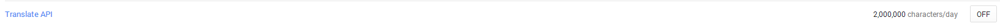

#Google Translate API 文档简译
文档地址: https://developers.google.com/translate/v2/getting_started

##简介
本篇文档主要针对的是应用程序和Google Translate Api(google翻译平台api)交互的开发者。[Google Translate](http//translate.google.com)是一个自动化翻译工具，能将一种语言翻译到另一种语言（例如，法语转换为英语），你能在应用程序和网页中使用Google Translate API。

##设置

如果在google开发者平台你还没有一个应用程序，那么需要先在[开发者平台](https://console.developers.google.com//start/api?id=translate&credential=client_key)设置一个。系统会提示你怎么做，同时会为你自动激活API。

如果你已经有了一个账号那么进行以下操作：

1. 去[开发者平台](https://console.developers.google.com//start/api?id=translate&credential=client_key)
2. 选择一个项目
3. 在左侧栏选择进入 **APIs & auth**，在APIs的列表中打开Google Translate API。
4. 在左侧栏选择进入**Credentials**

到这里先关闭上面的页面

>重要: Google Translate API V2需要开发者的计费信息，在使用服务之前。查看下面的指导开启计费。

为开启你的项目的计费信息，请按照下面的步骤执行：

1. 去[开发者平台](https://console.developers.google.com//start/api?id=translate&credential=client_key)
2. 选择一个项目
3. 左侧栏选择**Settings**。
4. 在 **Billing**部分, 选择 **Enable billing**。
5. 填写相应的信息

##API Key
你的应用发给Google Translate API的每一个请求必须能够找到你在Google上的应用，通过利用API Key。更多关于使用API Key的信息查看使用REST文档中的[识别你在谷歌上应用](https://developers.google.com/translate/v2/using_rest#auth)。

##Translate API背景

###Translate 的理念
它是一个语言的自动翻译工具。源语言是要被翻译的语言，源语言是那个写入的文本。目标语言是要翻译成为的语言。

###Translate API的使用
有三种方法可以使用

|操作|描述|REST HTTP mapping|样例|
|--|--|--|
|翻译|将源语言翻译为目标语言|GET|
|语言列表|列出翻译操作所支持的源语言和目标语言|GET|
|语言探测|探测源语言属于那种语言|GET

##发起请求的样式
有很多种方法调用API:

* 直接使用[REST](http://en.wikipedia.org/wiki/Representational_State_Transfer) 
* 使用javascript的 REST（不需要服务器端代码）

