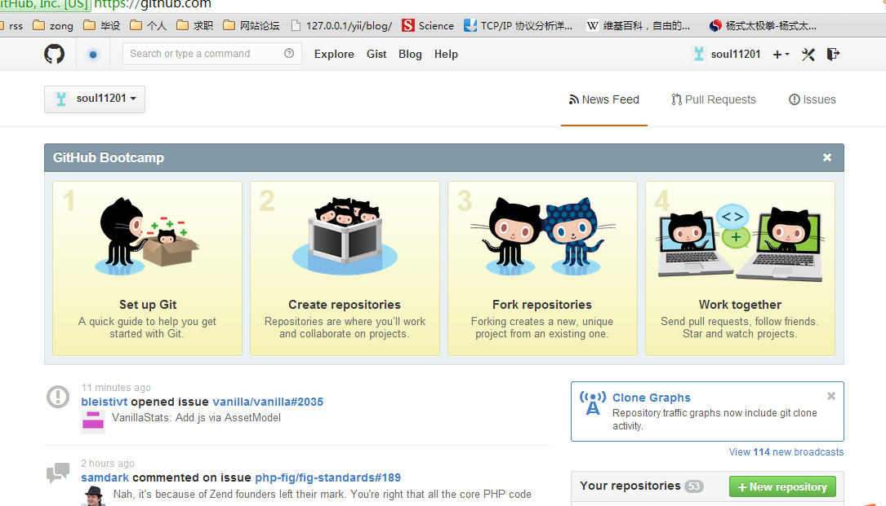
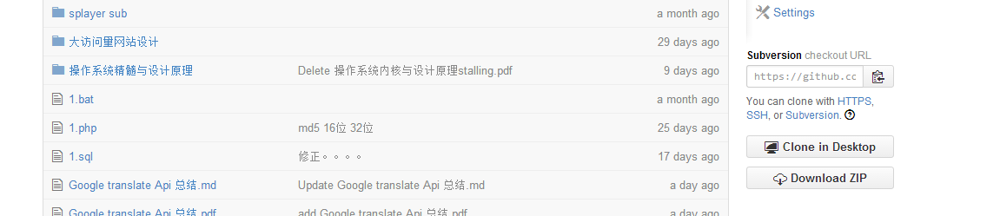
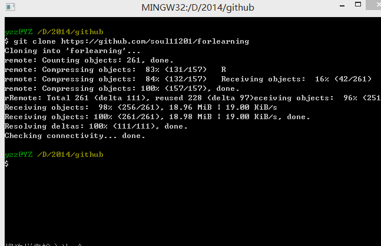
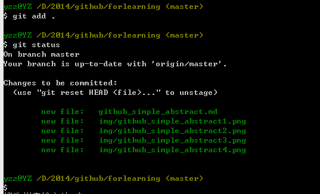
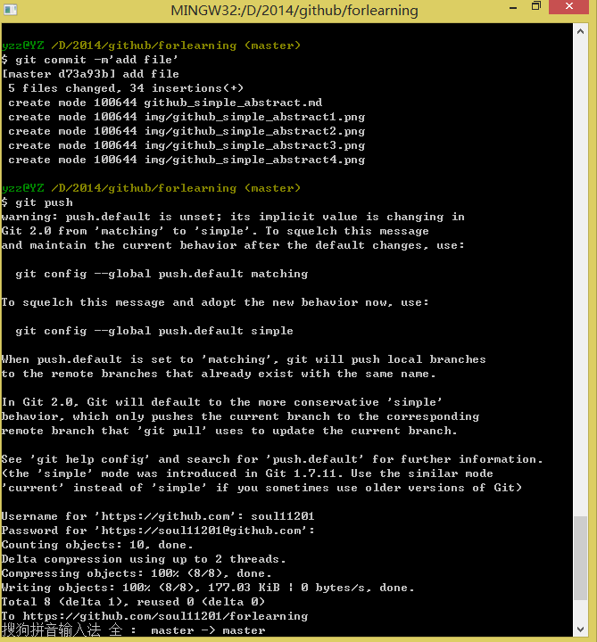

#github使用简单教程

##准备工作

* github账号一枚

* git 客户端工具一个 推荐 http://www.git-scm.com/

* 可以联网 :)

##流程

1. 在github上 创建repo。
 
 * 方法一
 	* 在[github](https://github.com) 的 [首页](https://github.com)点击[new repository](ttps://github.com/repositories/new),即下图的右下角按钮。

    	
 * 方法二
 	* 如下图示，在个人的主页中点击 new按钮

    	
 * 方法三
	* 最暴力方法，登陆github，账户后直接访问 https://github.com/new, 就直接进入创建repo的页面了

2. 进入创建页面后，填写代码库的名称，选择public 即可。private需要付费。

3.  进入repo，复制代码库的地址。如下图示的右下角，可以选择的url方式有三种，这里选择Subversion，既可以用Subverion，也可以用git的专用客户端clone代码库到本地：

		git clone https://github.com/soul11201/forlearning

       
4. 打开命令行，进入要在本地存放代码库的文件夹 执行 git clone命令然后就把gitHub代码库中代码clone到本地了。

  	

5. 把本地新添加的文档或对文件做的修改提交到github上去。使用史上最暴力的方法，如下图示执行命令    	

		git add .
这样就把已修改的和新添加的文件加入到要提交到github服务文件的队列中来。然后执行

		git status

就可以查看刚才操作后的状态如下图示,其中 **new file** 表示新添加的文件

	
然后执行：

		git commit -m'comments'，其中-m必须要有，添加后面添加要注释的信息

将代码提交到**本地代码库**，没错，确实是本地代码库，你没有看错，你只有先提交到本地代码库后，然后才能提交到github服务器端的代码库。这就体现了一个优越于其他版本控制系统的有点，就是没有联网的时候仍热可以疯狂式的提交代码到本地代码库，等到联网的时候再提交到github服务器的代码库。
最后执行

		git pushs
接着输入自己在github上的 **用户名** 和 **密码**然后就能提交了。

##遇到的问题
整个过程中可能遇到问题，但可以利用git提供的出错信息可以解决很多问题。我在提交的过程中就全局用户名和邮箱的没配置好的为题，就导致在执行commit 命令的时候一直出错，提示我使用如下格式的**git config **命令配置**用户名**和**邮箱**，配置完成后，问题就解决了，有时候看看手册和出错提示的信息，很多问题就咔嚓一下······，问题被解决掉了，然后就学到了新东西，新方法、原来问题还可以这样解决，心情就很愉悦了:):):):):):)。

	git config --global user.email "xx@xxx"
	
    gti config --global user.name "yyy"

##总结

其实github可以像我这样肤浅的认为是这个流程

1. github服务器穿件代码库
2. 从服务器clone代码到本地
3. 添加修改的文本或者新文件
4. 提交到本地代码库
5. 提交到服务器代码库

单个人如果只是在一台机器上开发程序也就是这个流程了，其实还要在4、5之间还有一步就是执行如下命令

	git pull

把服务器上最新版跟新到本地，因为服务器上的版本可能比本地上的搞，如果不先执行这条命令就执行

	git push
就会提示不能push 要求必须先pull ,这里体现了 **旧版本不能覆盖新版本，新版本覆盖旧版本** 这个理念
