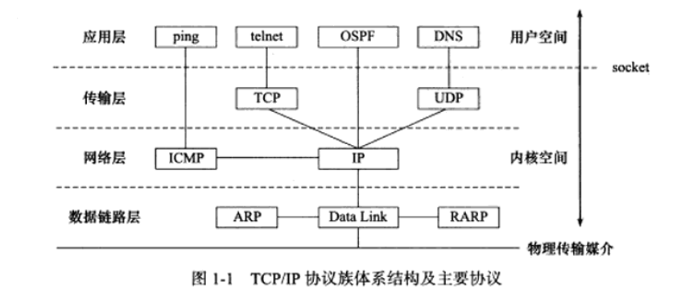

#第一章笔记

###体系结构

####icmp 协议

**8位类型** 字段区分 **报文类型**

|icmp类型|作用|举例|
|---|--|
|差错报文|用来回应网络错误|目标不可到达(类型值为3)、重定向（类型值为5）|
|查询报文|查询网络信息|ping程序使用icmp协议查询目标是否可到达（类型值为8）|

还有的用到 **8位代码** 字段来进进一步对不同的情况细分，重定向的报文使用代码值0表示对网络重定向，1表示对主机重定向。

使用**16位校检和**对整个报文包括头部和内容部分进行 **循环冗余校检**（CRC），用以检查数据在传输过程中是否损坏。

不同的**报文类型**有不同的 **报文内容**。 

>注意：icmp并非严格意义上的网络层协议，它使用同层的ip协议提供的服务