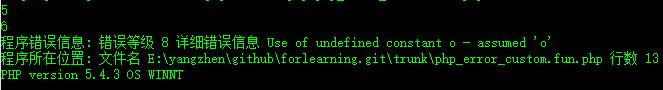

#网站运营碰到的问题
>1.大访问量

>2.大存储量

>3.访问速度

>4.服务器监控：服务器很多时，如何监控服务器出现的问题。

##大访问量解决方法

>负载均衡

>冗余技术

##负载均衡
实现 *负载均衡* 的技术
>cisco 或 华为的以太网通道

>Windows NLB技术

>linux LVS技术

>F5等负载均衡器

[__LVS__](./)
>典型lvs结构: 负载调度器 服务器池 共享存储

######名词：

    轮询

##冗余技术
>cisco HSRP 热备份路由 
>windows 集群技术
>Linux HA 集群技术
>IBＭAIX集群 : 基于unix的集群技术

__HSRP__
>线路数据冗余技术，多一个备份的路由器，网络层面的冗余技术，

__服务器的集群__

######名词：

	集群：集群中的计算机只有一台处于工作状态，其它的处于休眠状态 ,解决单点故障问题

	心跳线： 一台宕机，另一台立即工作

######网站的开发
	网络构架 服务器构架 应用程序开发

[参考视频](http://www.lampbrother.net/php/html/2013/php_teji_1010/172.html)