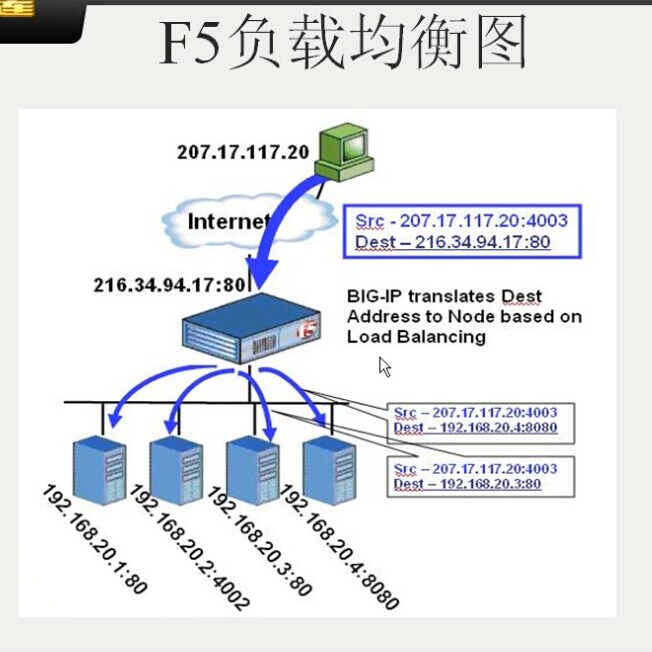
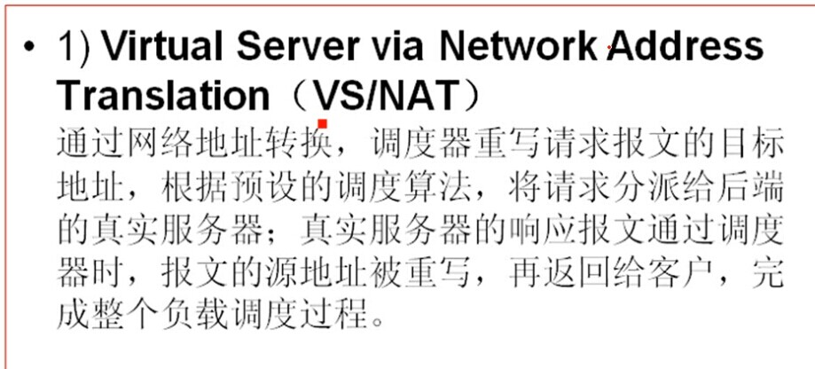
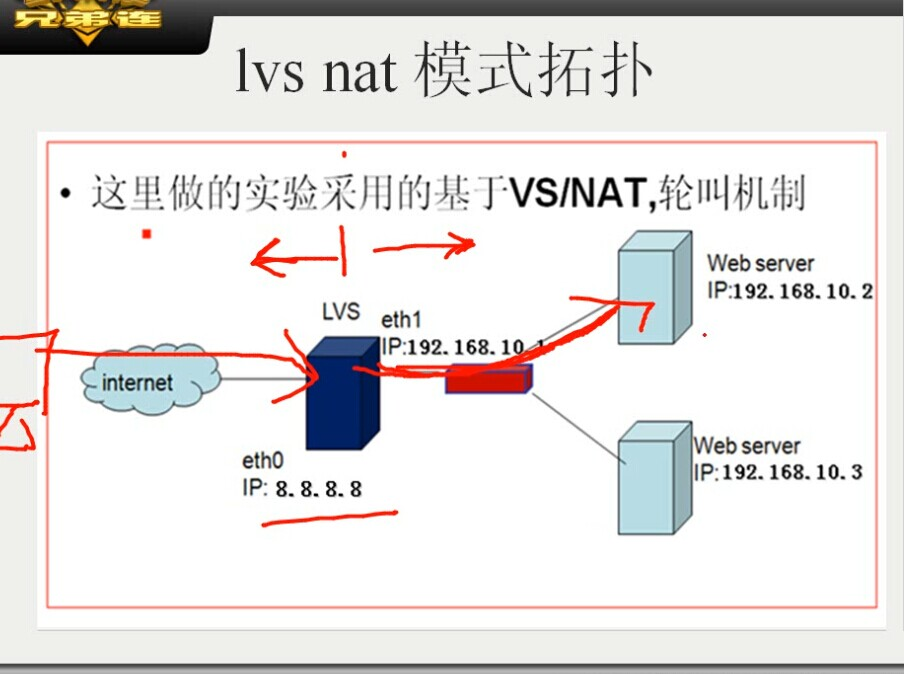
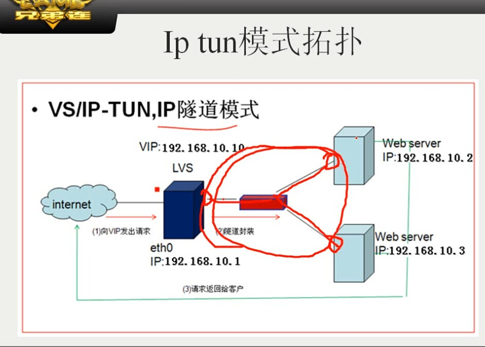
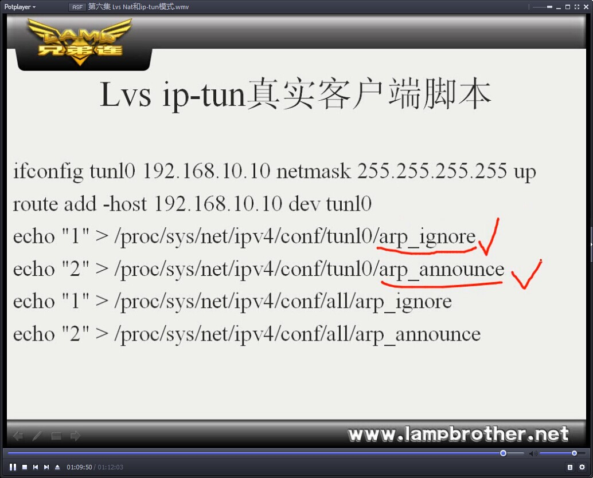

#第二天
######网络数据转发
需要理解的技术
>arp 、代理arp原理  路由器和交换机的作用

	路由器互联网络的不同网段的,网段与接口

	交换机记忆mac与接口

[第五集](http://www.lampbrother.net/php/html/2013/php_teji_1010/176.html)
***
##网络负载均衡
1. 基于网络设备的负载均衡

 * cisco 以太网通道

 * F5负载均衡器
 * 

2. 基于操作系统的负载均衡
 * nlb
 * lvs

 
##linux lvs 负载均衡 
lvs 三种负载均衡技术

>lvs nat 技术原理

>lvs ip-tun技术原理

>lvs dr 技术原理

###lvs nat模式拓扑

	nat + 轮询技术 + linux (服务器-->路由器技术)

优点
>内外分离

缺点

>速度瓶颈

###ip-tun模式

###lvs Dr 技术
	轮询 以一次 完整请求 为一次请求