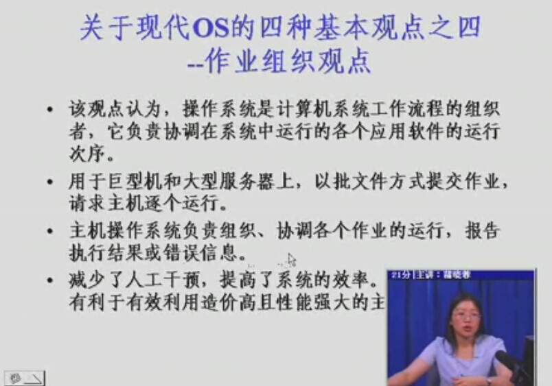
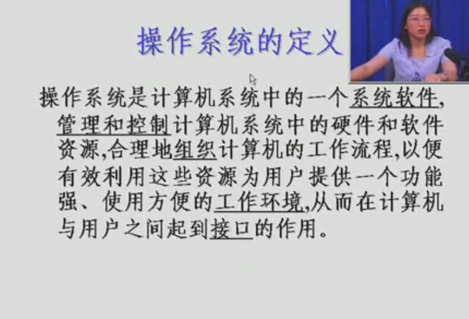

##1. 什么是操作系统

 ####1. 资源管理器观点
   
1. 分配、回收以及控制系统中的各种软硬件资源
2. 跟踪资源的使用、满足资源请求、提高资源利用率、协调程序和用户对资源的使用的冲突

>监视资源

>分配/回收资源

>保护资源

####2. 作业组织观点
1. 协调各个应用软件的运行次序
>巨型机和大型服务器上，以批文件方式提交作业，请求主机逐个运行,后面三句，是一句话。。。。

 

	总结

1. 系统软件
2. 管理控制
3. 组织计算机的工作流程
4. 为用户提供一个功能强、使用方便的工作环境
5. 计算机和用户之间的一个借口

##2.简历
	50s 简单批处理
    60s 多道批处理
    ..分时、实时系统
    80s 微机及网络操作系统
    嵌入式系统·····

##3.什么推动计算机发展
1. 计算机硬件的升级
2. 新硬件的出现
3. 新的服务需求、要方便使用
4. 提高计算机的资源利用效率
5. 更正软件错误
6. 体系结构升级---单机、多处理、分布式、计算机网络