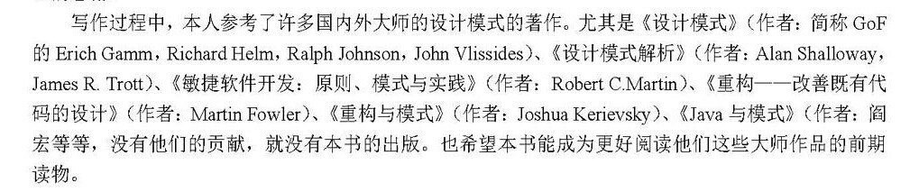

#适配器模式
**适配器模式**是将某个对象的接口适配到另一个对象所期望的接口。这是*__php设计模式__*这本书所给的定义，感觉很抽象，

>看这本书我感觉作者的目的不是写给人看的，好多句子感觉特别拗口，不知道不知道是原著就这样还是翻译有问题*（本人英语水平有限无法求证了）*

但是接着往下看书中所说的，不知不觉就会发现好像*php*中的*pdo*好像就是这个模式实现的。不看了，书看半天不知道说什么。

#大话设计模式
>如果想成为一名更优秀的软件设计师，了解优秀软件设计的演变过程比学习优秀设计本身更有价值，因为设计的演变过程中蕴藏着大智慧。--重构与模式

##好书籍

